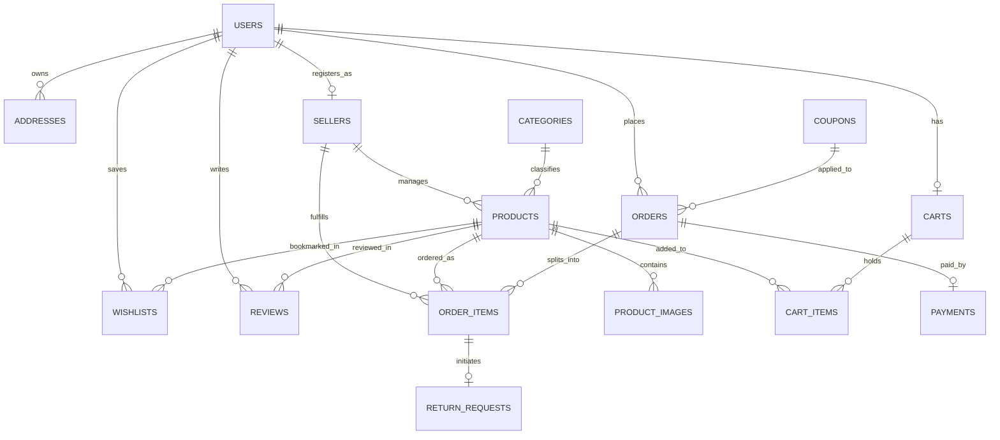
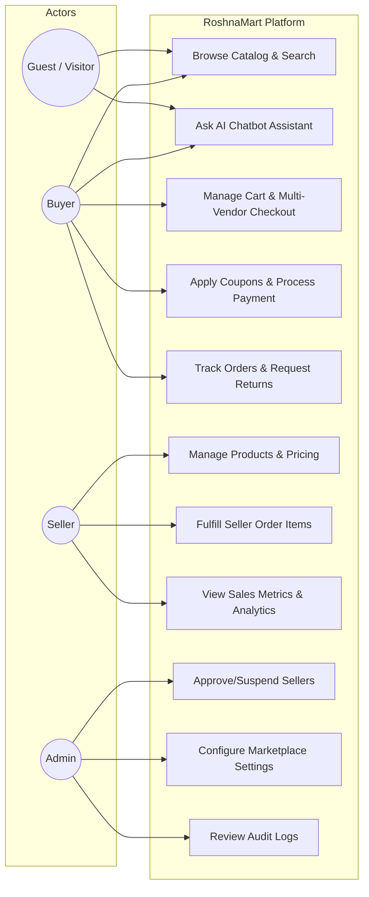
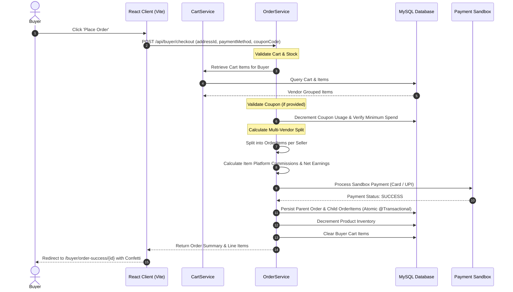

# RoshnaMart — Modern Multi-Vendor E-Commerce Marketplace

A production-style multi-vendor e-commerce platform built with **Spring Boot 3.3.3**, **MySQL 8**, **Java 17**, and **React 19 + Vite**. RoshnaMart seamlessly connects Buyers, Independent Sellers, and Platform Administrators in a secure, role-governed ecosystem.

---

## Key Features & Highlights

### 1. Multi-Vendor Architecture & Strict Seller Isolation
- **Role-Based Access Control**: Strict separation between `ROLE_BUYER`, `ROLE_SELLER`, and `ROLE_ADMIN` via JWT authentication and Spring Security.
- **Strict Data Isolation**: Sellers have access *only* to their own catalog products, orders, sales metrics, and notifications. Sellers cannot see or modify items belonging to another merchant.
- **Consolidated Multi-Vendor Checkout**: Buyers can add products from multiple distinct sellers into a single cart. During checkout, a single parent order is created and seamlessly split into seller-specific line items with independent fulfillment lifecycle tracking (`PLACED` → `PROCESSING` → `SHIPPED` → `DELIVERED` → `CANCELLED`).

### 2. Dynamic Marketplace Engine
- **No Hardcoded Configurations**: Marketplace commission rates, delivery charges, free shipping thresholds, minimum order requirements, and return windows are driven dynamically via backend database settings and exposed via `GET /api/settings`.
- **Dynamic Commission Accounting**: Calculates gross sales, platform commission deduction, and seller net earnings per order item.
- **Vendor-Grouped Cart & Real Progress Meter**: Visual grouping by seller in the shopping cart with live subtotal breakdown and free shipping goal indicators.
- **Interactive Online Payment Sandbox**: Realistic modal simulation with instant card validation and UPI handling.
- **Zero Browser Native Popups**: All confirmations, deactivations, and rejections utilize custom animated `ConfirmModal` dialogs.

### 3. Real Backend & Database Integration
- **Zero Fake Mock Data**: 100% of products, reviews, categories, sellers, coupons, addresses, orders, and audit logs originate from MySQL through Spring Boot REST APIs.
- **Debounced Live Search**: Real-time product search suggestions in the navigation bar querying backend catalog indexes.
- **Audit Logging**: Comprehensive administration log recording merchant approvals, suspensions, settings updates, and category changes.

### 4. AI Chatbot Backend Proxy & Floating Chat Widget (Phase 3)
- **Decoupled Provider Architecture**: `ChatProvider` interface (Section 17) decouples LLM logic from the servlet layer.
- **Mock & Real Providers**:
  - `MockChatProvider`: Canned FAQ answers for 10 core domain questions (products, orders, shipping, returns, payments, seller onboarding, tracking, coupons, support, multi-vendor isolation) with zero network calls.
  - `GeminiChatProvider`: Real Google Gemini LLM provider enabled via `ai.chatbot.provider=gemini` and `GEMINI_API_KEY`.
- **Strict Server-Side Key Storage**: API keys are stored exclusively in server environment variables or properties, never exposed to the client.
- **ChatServlet (`POST /api/chat`)**:
  - Validates input format and rejects blank requests (HTTP 400).
  - Enforces input length cap of 500 characters.
  - Enforces per-session rate limit (maximum 10 messages/minute, returning HTTP 429).
  - In-memory per-session caching: identical repeated questions within a session return instantaneous cached responses.
  - Outbound timeout and graceful error recovery: failures trigger a static degraded JSON fallback response rather than a 500 error page.
  - Fixed server-side prompt template restricting chatbot scope strictly to RoshnaMart product/listing domain queries.
- **Floating Chat Widget (`ChatWidget.jsx`)**:
  - Sleek expandable floating UI widget present across the entire storefront.
  - Quick FAQ suggestion pills for 1-click domain queries.
  - Live character count counter (`x/500`) and rate limit warning indicator.
  - Communicates directly via `fetch('/api/chat', POST {message})`.

---

## Architecture Diagrams

### D1. Entity-Relationship Diagram (ER Diagram)



### D2. Use Case Diagram



### D3. Sequence Diagram (Multi-Vendor Place-Order Flow)



---

## Technology Stack

| Layer | Technologies |
|---|---|
| **Backend** | Java 17, Spring Boot 3.3.3, Spring Data JPA, Hibernate ORM, Spring Security, jjwt 0.12.6, Spring Validation, Lombok |
| **AI Chatbot** | `ChatServlet`, `ChatProvider` Interface, `MockChatProvider`, `GeminiChatProvider`, In-Memory Session Cache, Rate Limiter |
| **Database** | MySQL 8.4 Community Server, HikariCP Connection Pooling |
| **Frontend** | React 19, Vite, Tailwind CSS, Lucide Icons, Axios, Canvas Confetti |
| **API Docs** | SpringDoc OpenAPI / Swagger UI 2.6.0 |

---

## Demo Credentials

All test accounts are pre-seeded in the database with BCrypt-hashed passwords:

| Role | Name | Email | Password | Details |
|---|---|---|---|---|
| **Admin** | Super Administrator | `admin@roshnamart.com` | `Admin@123` | Full administrative control, seller approval, settings, audit trail |
| **Seller A** | Apex Electronics Hub | `techseller@roshnamart.com` | `Seller@123` | Approved electronics vendor, 5% commission rate |
| **Seller B** | Urban Vogue Fashion | `fashionseller@roshnamart.com` | `Seller@123` | Approved apparel vendor, 5% commission rate |
| **Seller C** | Pure Organics & Naturals | `organicseller@roshnamart.com` | `Seller@123` | Merchant verification workflow testing |
| **Buyer** | John Doe | `buyer@roshnamart.com` | `Buyer@123` | Default buyer account with pre-configured addresses and order history |

---

## Available Coupons

Pre-seeded coupons for testing checkout discounts:

- `WELCOME10`: 10% discount on orders above ₹500 (Max discount ₹200)
- `ROSHNA20`: 20% discount on orders above ₹1,500 (Max discount ₹500)
- `SAVE50`: Flat ₹50 off on orders above ₹300

---

## Project Structure

```
RoshnaMart/
├── backend/
│   ├── src/main/java/com/roshnamart/
│   │   ├── config/             # SecurityConfig, ChatConfig, DataInitializer
│   │   ├── controller/         # Admin, Auth, Buyer, Seller, Settings, Product, Category
│   │   ├── dto/                # Request/Response Data Transfer Objects
│   │   ├── entity/             # JPA Entities (User, Seller, Product, Order, Cart, Coupon, etc.)
│   │   ├── repository/         # Spring Data JPA Repositories
│   │   ├── security/           # JWT Token Provider, Filters, UserDetails
│   │   ├── service/            # Core business logic & isolation enforcement
│   │   │   └── chat/           # ChatProvider, MockChatProvider, GeminiChatProvider
│   │   └── servlet/            # ChatServlet (rate limiting, validation, session caching)
│   └── pom.xml
├── frontend/
│   ├── src/
│   │   ├── components/         # Navbar, Footer, ChatWidget, ConfirmModal, Toast, Modal
│   │   ├── context/            # AuthContext, CartContext, ToastContext
│   │   ├── pages/              # Admin, Buyer, Seller, and Public storefront views
│   │   └── services/           # Axios service clients
│   ├── package.json
│   └── vite.config.js
├── CONTRIBUTING.md             # Complete setup steps from git clone to local instance
├── RETRO.md                    # Sprint retrospective logs
└── README.md
```

---

## Getting Started

Refer to [CONTRIBUTING.md](file:///d:/RoshnaMart/CONTRIBUTING.md) for full setup instructions, `.env` file management, and development guidelines.

### Quick Start
1. **Backend**:
   ```bash
   cd backend
   mvn clean spring-boot:run
   ```
2. **Frontend**:
   ```bash
   cd frontend
   npm install
   npm run dev
   ```
3. Open `http://localhost:5173` to browse the store and chat with the AI assistant!

---

## Running Verification & Tests

### Backend Unit & Integration Tests
```bash
cd backend
mvn test
```
All 17 unit and integration tests validate:
- Public marketplace settings retrieval
- Role-based authentication and token generation
- Multi-vendor cart isolation and transactional checkout
- Order fulfillment status synchronization
- `ChatServlet` input validation, 500-character cap, 10 msg/min rate limiting, in-memory caching, and degraded fallback

---

## License
MIT License. Built for RoshnaMart Marketplace.
